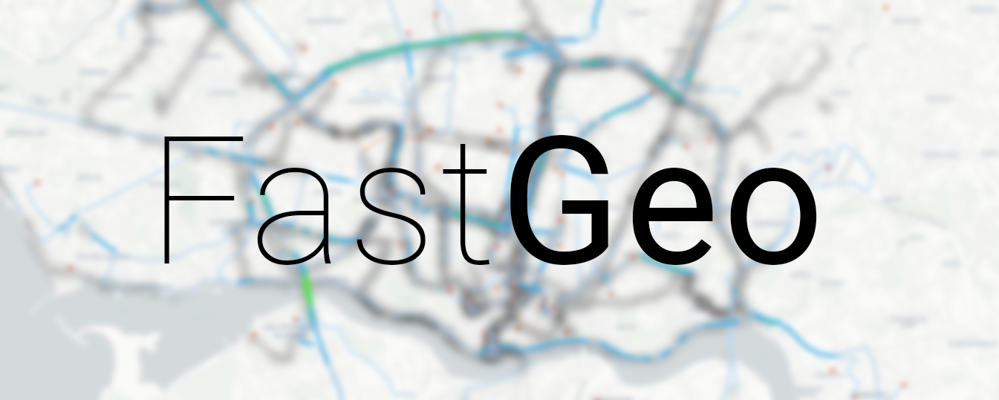

<p align="center">
  
</p>

Real-time visualization of large amounts of geospatial data. 

Developed for an MSc dissertation supervised by professors Daniel Gonçalves and Daniel Mendes.

### How to run
FastGeo requires Python 3, NodeJS and PostgreSQL (with PostGIS extensions).

Install any dependencies:
```
npm install 
pip install pyyaml psycopg2 ujson
```

Place your data in `src/data/raw`.

In `index.js`, update your database credentials, and configure any settings you may wish to in `config.yaml`.

Run the Node.js server:

```
cd src/fastgeo
npm start
```

Open a browser and go to http://localhost:3000/.

For more details, check the [guide](docs/GUIDE.md).